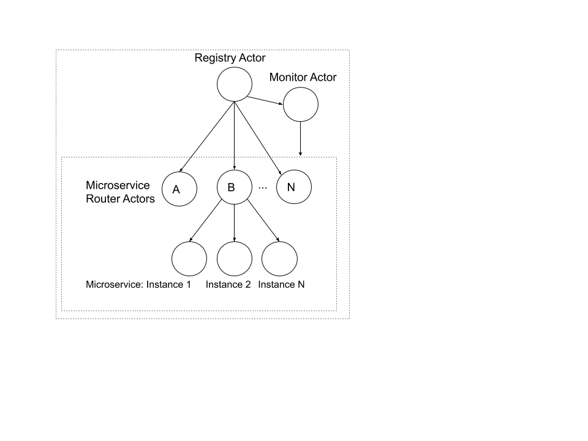

# Service Registry
This project is a reference implementation of a Service Registry for managing microservice 
applications using Akka actors built with Akka-Http framework.

### Prerequisites
Java 11

Scala 2.13

Sbt 1.3

### Running
From terminal run: `sbt run`

The server will start at: http://localhost:8080/

### REST APIs

1. POST http://localhost:8080/api/deployment

Accepts an input JSON deployment specification and create the specified microservice instances.

Input format:
```
[{
"name": "ServiceA",
"entryPoint": true,
 "replicas": 2,
 "dependencies": []
}]
```
Response: Appropriate HTTP Status with a Json status message

2. GET http://localhost:8080/api/deployment

Creates a health check report of all microservices.

Response: A JSON array of list of running microservices
   
3. POST http://localhost:8080/api/healthcheck

Response: None
   
4. GET http://localhost:8080/api/healthcheck

Response: A JSON array of health check results

## Architecture
The ServiceRegistry application has been designed using the [Akka Actor Model](https://doc.akka.io/docs/akka/2.5.32/guide/actors-intro.html).
Actor model is one of the proven choice for distributed system design. 

In this application a Microservice  is represented by an Actor. 
The Microservice Registry, and the Microservice replicas are also represented by Actors.




### Testing


```
[{
"name": "ServiceA",
"entryPoint": true,
 "replicas": 2,
 "dependencies": ["ServiceB","ServiceC"]
},
{
"name": "ServiceB",
"entryPoint": false,
 "replicas": 2,
 "dependencies": [ "ServiceC"]
},
{
"name": "ServiceC",
"entryPoint": false,
 "replicas": 2,
 "dependencies": ["ServiceD"]
},
{
"name": "ServiceD",
"entryPoint": false,
 "replicas": 2,
 "dependencies": []
}]
```
In the console we can see the log messages of Microservice instances created and the order. 


2. 

