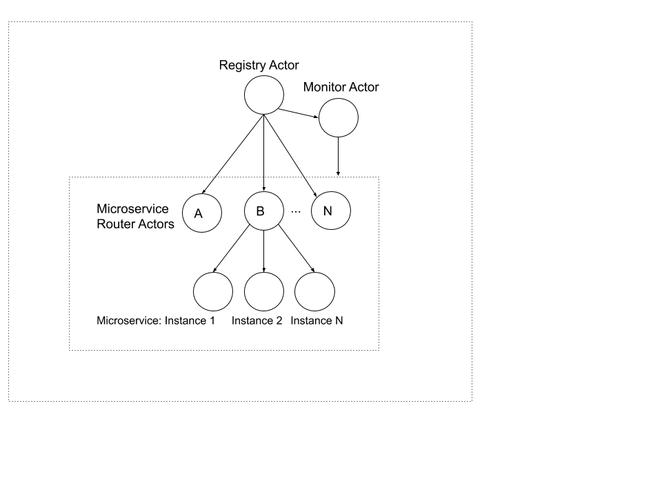

# Service Registry
This project is a reference implementation of a Service Registry for managing microservice 
applications using Akka actors built with Akka-Http framework.

### Prerequisites
Java 11

Scala 2.13

Sbt 1.3

### Running
From terminal run: `sbt run`

The server will start at: http://localhost:8080/

### REST APIs

1. **POST http://localhost:8080/api/deployment**

Accepts an input JSON deployment specification and create the specified microservice instances.

Input format:
```
[{
"name": "ServiceA",
"entryPoint": true,
 "replicas": 2,
 "dependencies": []
}]
```
Response: Appropriate HTTP Status with a Json status message

2. **GET http://localhost:8080/api/deployment**

Creates a health check report of all microservices.

Response: A JSON array of list of running microservices


3. **POST http://localhost:8080/api/healthcheck**

The POST healthcheck api doesn't return any results since the health check process can take a while. 
To get the result use the GET healthcheck api after a time delay. Ideally this api should be designed using websockets. 


Response: None
   
4. **GET http://localhost:8080/api/healthcheck**

Response: A JSON array of health check results

5. **GET http://localhost:8080/api/greeting?service='service name'**

This greeting api is just for testing the replicas. Since the messages to microservices are routed
   in a Round-Robin fashion, for each request the replicas will respond in a cyclic order. 
Response: None, check the console log to see the response. 

## Architecture
The ServiceRegistry application has been designed using the [Akka Actor Model](https://doc.akka.io/docs/akka/2.5.32/guide/actors-intro.html).
Actor model is one of the proven design choice for distributed systems. 



### Actor Design

In this architecture a Microservice instance as well as the Microservice Router, and the Microservice Registry are represented by Actors.

**MicroserviceActor:** The Microservice-Actor represents a single instance of Microservice. 
In a real world scenario this actor  manage all interactions, and the life cycle of a give Microservice.

**RouterActor:** The RouterActor acts as a Router for the replicas of a Microservice. It routes
messages to the instances in a Round-Robin fashion. 

**RegistryActor:** The registry actor manages all the Microservice router actors, and it's instances.
It also manages the Monitor Actor and can check the health of all the Microservice instances. 

**MonitorActor:** The MonitorActor pings all the microservice instances and waits for a reply. 
The MonitorActor then tracks the Microservices that have replied, stopped and not replied. 
A report on the health of all microservices then send back to the requester. 


### Checking cyclic dependencies
From the deployment input we can model the dependencies in to a Graph structure. The graph can then
be searched for cycles using a [Depth First Search](https://en.wikipedia.org/wiki/Depth-first_search). 

A similar approach can be also employed for creating an ordered dependency List.

### Testing
For testing the backend application use the [PostMan collection](./ServiceRegistry.postman_collection.json) file include with this git repo. 
Given below are some sample inputs. 

1. **Create Deployment:**

POST http://localhost:8080/api/deployment
```
[{
"name": "ServiceA",
"entryPoint": true,
 "replicas": 2,
 "dependencies": ["ServiceB","ServiceC"]
},
{
"name": "ServiceB",
"entryPoint": false,
 "replicas": 2,
 "dependencies": [ "ServiceC"]
},
{
"name": "ServiceC",
"entryPoint": false,
 "replicas": 2,
 "dependencies": ["ServiceD"]
},
{
"name": "ServiceD",
"entryPoint": false,
 "replicas": 2,
 "dependencies": []
}]
```
In the console we can see the log messages of Microservice instances created in the order. 


2. **Check cyclic dependency:**

POST http://localhost:8080/api/deployment

```
[{
"name": "ServiceA",
"entryPoint": true,
 "replicas": 2,
 "dependencies": ["ServiceB","ServiceC"]
},
{
"name": "ServiceB",
"entryPoint": false,
 "replicas": 2,
 "dependencies": [ "ServiceC"]
},
{
"name": "ServiceC",
"entryPoint": false,
 "replicas": 2,
 "dependencies": ["ServiceD"]
},
{
"name": "ServiceD",
"entryPoint": false,
 "replicas": 2,
 "dependencies": ["ServiceA"]
}]

```

## General Notes: 

### Future improvements 

1. **WebSocket API**: The traditional Request-Response API is not well suited for an asynchronous, distributed architecture. 
A Websockets api which implements a full-duplex communication between Client and Server is necessary to take the full advantage of an Actor based design. 

2. **Persistence:** If the RegistryService crashes or restarts, the state of the service is lost. 
To persist the state of actors and deployments, a Database and/or Akka-Persistence can be used. 

3. **Swagger API:** For better API documentation

4. **HTTPS Support** 

5. **Dockerize the application**

5. **Implement a CI-CD pipeline**

### Time spent: 
I haven't programmed in Scala for more than a year, so had to spend some time initially for refreshing Scala and learning
Akka and Akka-Http. After that it took around 12 hrs for backend development, 8 hrs for frontend development and 3 hrs for
testing and documentation.


